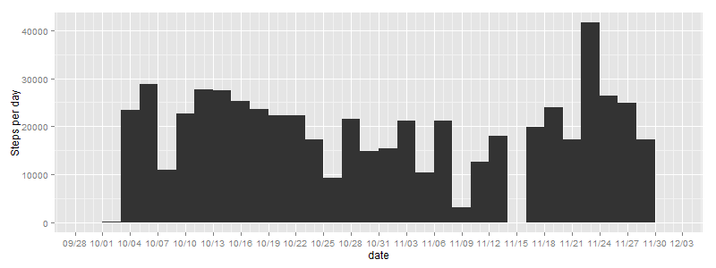
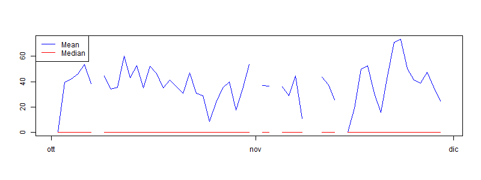
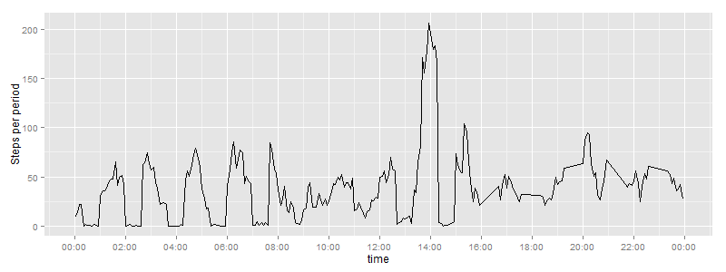
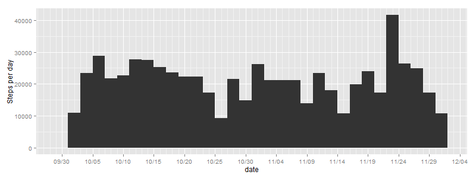
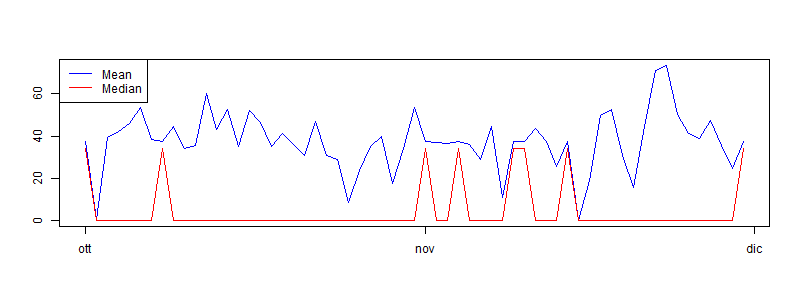
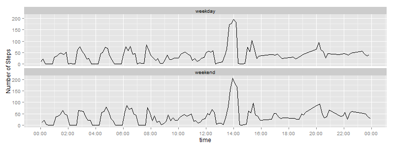

```r
suppressWarnings(library(lubridate))
suppressWarnings(library(dplyr))
suppressWarnings(library(ggplot2))
suppressWarnings(library(scales))
```

# Reproducible Research - Assignement 1

## Loading and preprocessing the data

Here I load data and preprocess them with the Lubridate package:

* date, in order to convert from character to POSIXct,
* adding a time column, as I'd like to see hour instead of interval, I have added interval value to a dummy date, so I can use it in my next graph instead of interval value.


```r
data <- read.csv("data/activity.csv")
data$date <- ymd(data$date)
data$time <- ymd_hm(paste("2015/05/13", format(update(data$date, minute = data$interval), "%H:%M"), sep = " "))
```

## What is mean total number of steps taken per day?

A histogram is made up of columns plotted on a graph. Usually, there is no space between adjacent columns. Here is how to read a histogram.

* The columns are positioned over a label that represents a quantitative variable.
* The column label can be a single value or a range of values.
* The height of the column indicates the size of the group defined by the column label.


```r
png("figure/hist.png", width=800, height=300)
summarise(group_by(data, date), step = sum(steps))%>%
ggplot() + 
    geom_histogram(aes(x=date, weight=step)) +
    ylab("Steps per day") +
    scale_x_datetime(labels = date_format("%m/%d"), breaks = date_breaks("5 day"), minor_breaks = "1 day")
dev.off()
```



And here is mean and median of total number of steps taken per days.
Please notice that where the line are missing, there's NA values on the original data.


```r
png("figure/steps.png", width=800, height=300)
plot2data <- summarise(group_by(data, date), mean = mean(steps, na.rm = TRUE), median = median(steps))
plot(plot2data$date, 
     plot2data$mean, 
     type="l", 
     col = "blue", 
     ylab = "",
     xlab = "") 
lines(plot2data$date, plot2data$median, col = "red")
legend("topleft", c("Mean", "Median"), lty = c(1,1), col = c("blue","red"))
dev.off()
```



## What is the average daily activity pattern?

Instead of interval I'm using Hou and minutes to graph daily steps taken for each interval.


```r
png("figure/dailyactivity.png", width=800, height=300)
summarise(group_by(data, time), mean = mean(steps, na.rm = TRUE))%>%
    ggplot() +
    geom_line(aes(time, y=mean)) + 
    scale_x_datetime(labels = date_format("%H:%M"), breaks = date_breaks("2 hour")) +
    labs(y="Steps per period")
dev.off()
```



Here is the 5-minute interval that contains the maximum number of steps:


```r
summarise(group_by(data, interval), mean = mean(steps, na.rm = TRUE))%>%
arrange(desc(mean))%>%
    head(1)
```

```
## Source: local data frame [1 x 2]
## 
##   interval     mean
## 1      835 206.1698
```

## Inputing missing values

Row with missing values are:


```r
sum(is.na(data$steps))
```

```
## [1] 2304
```

I've decided to fill them with the mean of the related interval.
So i've calculated the mean of steps for each interval, create a new dataset *datawithoutna*, where I filled the missing data.


```r
intervalsmean <- summarise(group_by(data, interval), mean = mean(steps, na.rm = TRUE))
datawithoutna <- data
ind <- which(is.na(data$steps), arr.ind = TRUE)
for (i in 1:length(ind)) {
    interval <- datawithoutna$interval[ind[i]]
    datawithoutna$steps[ind[i]] <- intervalsmean$mean[intervalsmean$interval == interval]
}
```

Just to be sue check if there some more missing data


```r
sum(is.na(datawithoutna$steps))
```

```
## [1] 0
```

I've recreated an histogram with the new dataset, where we can see that mean and median differ from the first plot. 
Inputing missing data we have:

* filled missing column in the histogram
* got a great impact on the median, where in the first plot was always 0
* removed truncated lines of means and median


```r
png("figure/histwithoutnas.png", width=800, height=300)
summarise(group_by(datawithoutna, date), step = sum(steps))%>%
    ggplot() + 
    geom_histogram(aes(x=date, weight=step)) +
    ylab("Steps per day") +
    scale_x_datetime(labels = date_format("%m/%d"), breaks = date_breaks("5 day"), minor_breaks = "1 day")
dev.off()
```




```r
png("figure/stepswithoutnas.png", width=800, height=300)
plot5data <- summarise(group_by(datawithoutna, date), mean = mean(steps, na.rm = TRUE), median = median(steps))
plot(plot5data$date, 
     plot5data$mean, 
     type="l", 
     col = "blue", 
     ylab = "",
     xlab = "") 
lines(plot5data$date, plot5data$median, col = "red")
legend("topleft", c("Mean", "Median"), lty = c(1,1), col = c("blue","red"))
dev.off()
```



## Are there differences in activity patterns between weekdays and weekends?

In order to reply to this question we have to create a new feature with a factor containing "weekday" or "weekend".

I'm from Italy so you'll find "Sab" and "Dom" instead of Sat and Sun in the ifesle condition.


```r
datawithoutna$weekday <- ifelse(weekdays(datawithoutna$date) == "Sab" | weekdays(datawithoutna$date) == "Dom", "weekend", "weekday")
datawithoutna$weekday <- factor(c("weekday","weekend"))
```


```r
png("figure/activitypatterns.png", width=800, height=300)
summarise(group_by(datawithoutna, time, weekday), mean = mean(steps))%>%
    ggplot() +
    geom_line(aes(time, y=mean)) + 
    scale_x_datetime(labels = date_format("%H:%M"), breaks = date_breaks("2 hour")) +
    facet_wrap( ~ weekday, nrow = 2, ncol = 1 ) +
    labs(y = "Number of Steps")
dev.off()
```


